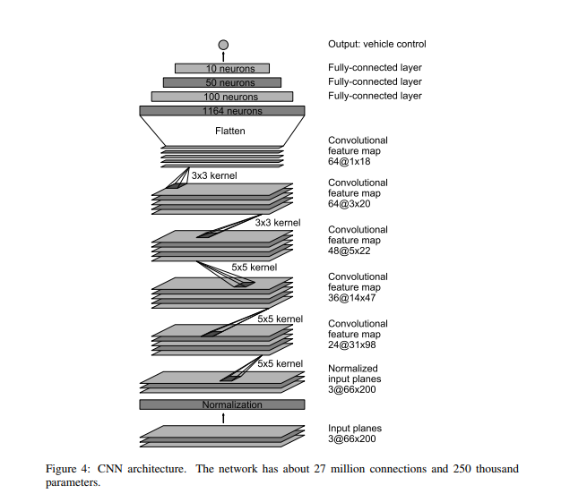

# **Behavioral Cloning** 
### Learning from human demostration for self-driving car

---

In this project, a neural network developed by NVIDIA in this [paper](http://images.nvidia.com/content/tegra/automotive/images/2016/solutions/pdf/end-to-end-dl-using-px.pdf) is used as a controller to drive a car in a simulator developed by Udacity. The neural network uses images as input and steering angles as output.

The related files are:

* `beta_simulator`: The simulator developed by Udacity.
* `data`: The data provided by Udacity, which has 24,108 images captured from human demostration.
* `drive.py`: The code to run trained model in simulation. You can do so by choosing the 'Autonomous Mode' in simulator, and run `python drive.py model.h5` in another terminal.
* `model.py`: The code contains neural network and image processing functions.
* `model.h5`: Trained model.
* `video.py`: The code to record the simulation result.
* `run1.mp4`: The test drive result.

---
####1. The network architecture 
The image is from NVIDIA paper:
 
 
 I kept the entire network and didn't make changes. To reduce overfitting, I limited the training epochs to be 3. Experiments shows that increasing the epochs to 5 would cause overfitting, and result in a poor performence. Also, Adam optimizer is used instead of classical stochastic gradient descent.
 
---
####2. Training data set
I used the sample data provided by Udacity. One can get new data using simulator in training mode.
####3. Data augmentation
* Images are normalized.
* Images are cropped, so only road parts are kept.
* Images are filped horizontally so more data is available.
* The steering measurements of left camera images and right camera images are corrected by 0.2 to help the car recover from diverging.
---
####4. Further analysis
The stability of neural network in control is still a research topic. In this project, the trajectory of each lap run is always not the same. In some cases, neural network may output a wrong steering command and drive the car out of the track. Although more training data would make the situation better, the application of neural network in control still needs some breakthrough. 